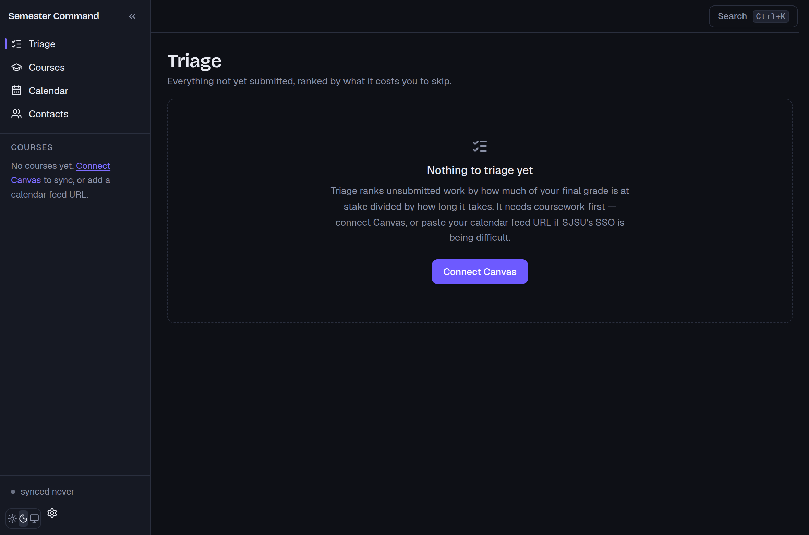

# Semester Command

A local-first desktop app that pulls your Canvas coursework and tells you what to work on next and what you need to score to hit your target grade. It runs entirely on your machine — no accounts, no server, no cloud sync — and it is strictly read-only against Canvas: it issues `GET` requests and nothing else. Every write it makes goes to a SQLite file in your app data directory.

Built for San José State (`sjsu.instructure.com`), where student-generated API tokens are disabled, so it authenticates by borrowing your own signed-in browser session instead.

> **Status: Milestone 0 (scaffold).** The app launches, switches themes cleanly, and the design system is in place with contrast verified in both modes. Canvas sync lands in M1 and the grade engine in M2. See [Milestones](#milestones).



---

## Where do I look first?

| I want to change… | Open |
|---|---|
| **Grade math** — weighted vs. points, current vs. projected, the solver | `src-tauri/src/grades.rs` |
| What a Canvas request looks like | `src-tauri/src/canvas/endpoints.rs` |
| Auth, pagination, rate limiting, retry | `src-tauri/src/canvas/client.rs` |
| How a synced row is written without clobbering my own data | `src-tauri/src/db/upsert.rs` |
| What the frontend is allowed to call | `src-tauri/src/commands/` |
| Triage ranking | `src-tauri/src/triage.rs` |
| What shows on the home screen | `src/routes/Triage.tsx` |
| Colours, type, spacing | `src/styles/globals.css` and `tailwind.config.ts` |
| The sidebar, header and shortcuts | `src/components/layout/` |
| Every `invoke()` call in the app | `src/lib/ipc.ts` |
| Database schema | `src-tauri/migrations/` |

Two rules that the file layout is designed to enforce:

- **The frontend contains no grade math.** It renders what `commands/grades.rs` returns. A percentage computed in TypeScript is a bug.
- **Every `invoke()` goes through `src/lib/ipc.ts`.** `grep -r "invoke(" src/` should only ever match that one file.

---

## Prerequisites

| | Version | Notes |
|---|---|---|
| **Rust** | 1.77+ | via [rustup](https://rustup.rs) |
| **Node** | 20+ | 22 recommended |
| **Canvas access** | — | No token needed. You sign in through SJSU SSO in a window the app opens. See [Authentication](#authentication). |

Plus the platform toolchain Tauri needs:

<details>
<summary><b>Windows</b></summary>

- [Microsoft C++ Build Tools](https://visualstudio.microsoft.com/visual-cpp-build-tools/) with the *Desktop development with C++* workload
- [WebView2 runtime](https://developer.microsoft.com/microsoft-edge/webview2/) — already present on Windows 11 and most Windows 10 installs
</details>

<details>
<summary><b>macOS</b></summary>

```sh
xcode-select --install
```
</details>

<details>
<summary><b>Linux</b></summary>

```sh
sudo apt install libwebkit2gtk-4.1-dev libsoup-3.0-dev build-essential \
  curl wget file libxdo-dev libssl-dev libayatana-appindicator3-dev librsvg2-dev
```
</details>

---

## Setup

```sh
git clone <your-remote> semester-command
cd semester-command
npm install
```

That is the whole setup. There is no `.env` to fill in and no key to paste — credentials live in your OS keychain and are put there by signing in from inside the app.

## Run

```sh
npm run tauri:dev     # the real app: Rust backend + webview
npm run dev           # frontend only, in a browser — fast for UI work, no Canvas
```

`npm run dev` is genuinely useful: every IPC call degrades to a sensible standalone value, so you can push pixels around without waiting on a Rust rebuild. Anything that needs real data needs `tauri:dev`.

Two dev-only extras:

- **`/#/dev/tokens`** renders every design token with its contrast ratio *measured live*. Flip the theme and watch the numbers move. Stripped from release builds.
- **`npm run check:tokens`** does the same from the CSS source and exits non-zero on a failure.

## Build a release

```sh
npm run tauri:build
```

Installers land in `src-tauri/target/release/bundle/` — `.msi`/`.exe` on Windows, `.dmg`/`.app` on macOS, `.deb`/`.AppImage` on Linux.

## Verify

```sh
npm run verify        # typecheck + lint + token contrast + Rust tests
```

Run this before every commit. It is what CI would run.

---

## Authentication

SJSU has disabled student-generated access tokens — the Canvas settings page says so outright. There are three tiers, each degrading into the next, and all three are real supported modes.

**Tier 1 — session cookie (primary).** The app opens a second window at `sjsu.instructure.com`. You sign in through SSO yourself, MFA and all; the app never sees your password. It then harvests the session cookie from that webview and attaches it to its own requests. Sessions expire and SSO forces periodic re-auth, so this is treated as short-lived by design: a `401`, a redirect to the SSO host, or HTML where JSON was expected all surface a non-blocking "Reconnect to Canvas" banner. Grades on screen are marked stale rather than quietly left to look current.

**Tier 0 — an admin-issued token.** If SJSU's CFETI (`cfeti@sjsu.edu`) ever issues you a scoped read-only token, paste it into Settings and Tier 1 becomes unnecessary. The client keeps both behind one `AuthMode` interface so the swap is one line.

**Tier 2 — calendar feed.** Canvas publishes a private `.ics` feed at Calendar → Calendar Feed that needs no login at all and covers every due date across every course. It carries dates only — no grades, weights or rubrics — but paired with entering scores by hand the grade engine still works end to end. If cookie auth breaks mid-semester, this is what keeps the app useful.

Anything not confirmed by the Canvas API is visibly marked in the UI. You should always know which numbers came from Canvas and which you typed in yourself.

**On politeness.** Sync runs at most every 30 minutes, caps concurrency at four requests, and backs off on any error. This is your own data on your own machine, but it is still someone else's server.

---

## Milestones

| | | Status |
|---|---|---|
| **M0** | Scaffold, design system, theme | ✅ done |
| **M1** | Auth, Canvas client, DB, sync, ICS fallback | ⬜ next |
| **M2** | Grade engine + tests | ⬜ |
| **M3** | The four screens, Grade Gap bar | ⬜ |
| **M4** | Tray, autostart, notifications, `.ics` export | ⬜ |
| **M5** | MCP server mode (`--mcp`) | ⬜ |

Each milestone stops for review before the next begins. `SPEC.md` is the contract; where this README and the spec disagree, the spec wins and the README is wrong.

---

## Documentation

| | |
|---|---|
| [`docs/ARCHITECTURE.md`](docs/ARCHITECTURE.md) | Data flow end to end, and why grade math lives in Rust |
| [`docs/CANVAS_API.md`](docs/CANVAS_API.md) | Every endpoint, pagination, rate limits, and the gotchas list |
| [`docs/GRADE_ENGINE.md`](docs/GRADE_ENGINE.md) | Both grading modes with worked examples, the solver derivation |
| [`docs/UI_SYSTEM.md`](docs/UI_SYSTEM.md) | Tokens, type scale, the signal-colour contract, motion rules |
| [`docs/DEVELOPMENT.md`](docs/DEVELOPMENT.md) | How to add an endpoint, a command, a migration; common failure modes |

---

## Scope

This app **will not**: submit anything to Canvas, interact with a live assessment, sync to a server, ask you to make an account, or gamify your semester. It reads your coursework and does arithmetic on it. That is the whole product.
